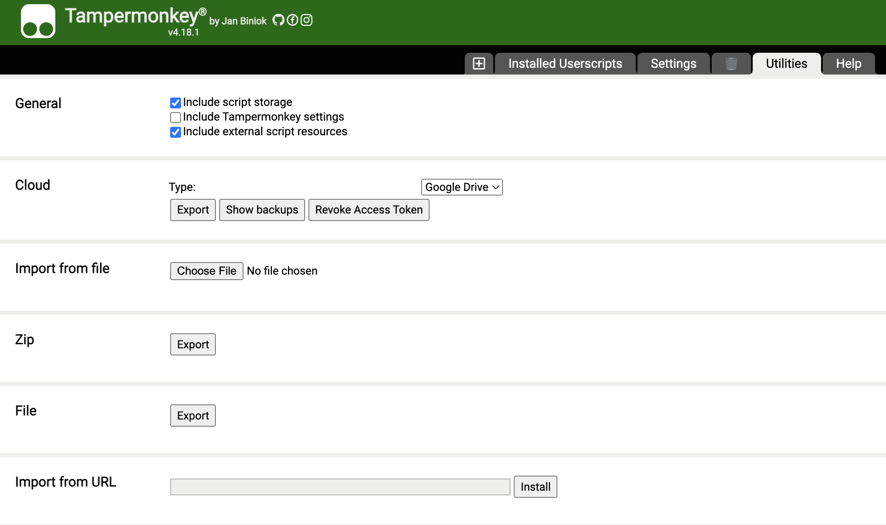
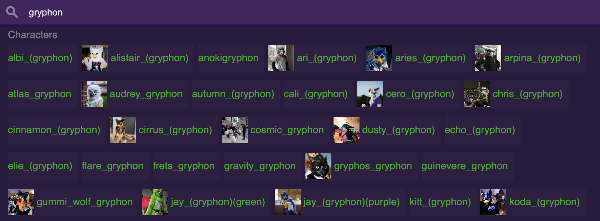
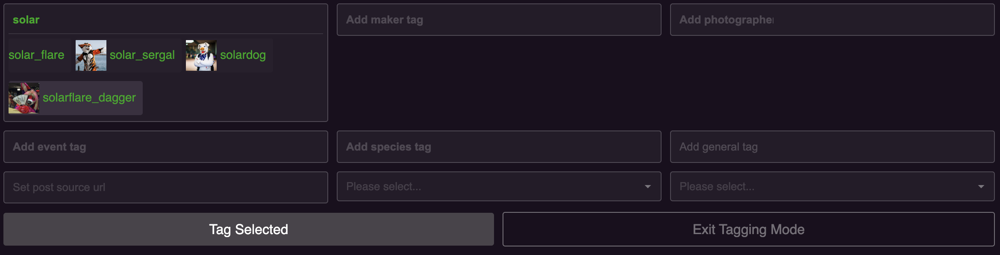
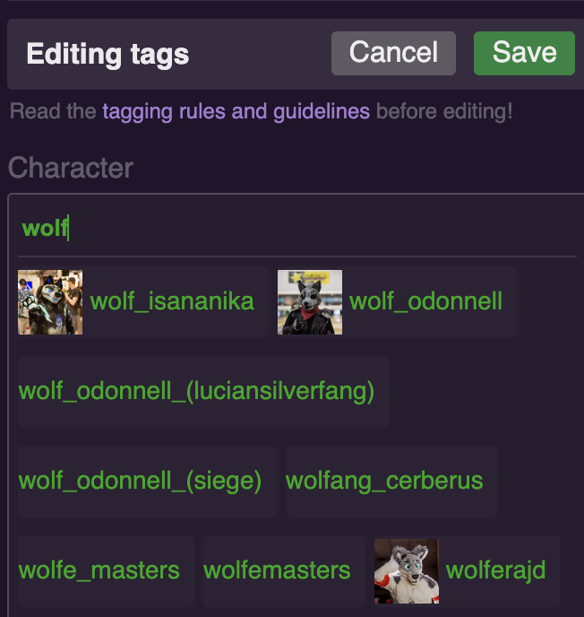

# furtrack-tag-icons

This is a [userscript][] which shows icon on character tags on
[FurTrack][furtrack], helping you on tagging and searching.

[userscript]: https://en.wikipedia.org/wiki/Userscript
[furtrack]: https://www.furtrack.com/

## Install

### Supported Browsers

This userscript is tested on Google Chrome and Firefox. You should expect full
compatibility if you are on a reasonably recent version. There is no guarantee
on other browsers.

### Steps

1. Install [Tampermonkey][] extension on your browser.
1. Go to the extension's "Dashboard" page, select the "Utilities" tab.
1. Put the following URL in "Import from URL" field then click "Install".

```
https://github.com/gryphonfluff/furtrack-tag-icons/releases/latest/download/furtrack-tag-icons.js
```



[Tampermonkey]: https://www.tampermonkey.net/

## Screenshots

* Search



* Tagging Mode



* Edit Tags on Posts



## License

[MIT License](LICENSE.txt)
